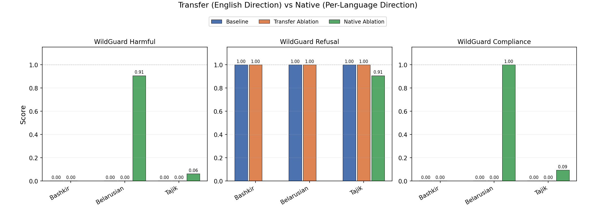

## Results of Cross-Lingual Transfer



WildGuard evaluation metrics for low-resource languages (Bashkir, Belarusian, Tajik) under baseline, English transfer ablation, and native per-language ablation show that transferring the English refusal direction has **no measurable effect** on model refusal behavior, while native directions successfully bypass refusal. This suggests that the dominant refusal mechanism in low-resource languages is language-specific and distinct from the English safety refusal direction. A plausible contributing factor is weaker language comprehension in these languages, which may limit the model’s ability to internalize or activate safety representations learned in English and may reduce semantic alignment between transferred and native representations.

Experiments were running for 4 days in total, please sorry for the delay.


-------------------------------- Original Readme ----------------------------

# Refusal Direction is Universal Across Safety-Aligned Languages

This repository contains the code and dataset for the paper "Refusal Direction is Universal Across Safety-Aligned Languages".

## PolyRefuse Dataset

The **PolyRefuse** dataset is a multilingual safety evaluation dataset covering 14 languages: ar, de, en, es, fr, it, ja, ko, nl, pl, ru, th, zh, yo.

You can find the dataset in the [`PolyRefuse/`](PolyRefuse) directory, which contains:
- Harmful prompts (train/val/test splits) translated to all languages
- Harmless prompts (train/val/test splits) translated to all languages
- Back-translated versions for analysis

## Setup

### Installation

```bash
source setup.sh
```
Install the evaluation harness from source

```bash
cd lm-evaluation-harness
pip install -e .
``` 
## Usage

### Running Experiments

#### Refusal Vector Ablation

```bash
# Configure your experiment settings in configs/cfg.yaml
python -m pipeline.run_pipeline --config configs/cfg.yaml
```
#### for example, we run the experiment on Qwen2.5-7B-Instruct model in Japanese with the following settings:

```bash
python -m pipeline.run_pipeline --config runs/Qwen2.5-7B-Instruct/ja/ja.yaml
```

#### Evaluating the model on multiple languages

```bash
# For running multiple language evaluation configurations
python -m scripts.multi_test --config configs/cfg.yaml
```

#### for example, we evaluate the Qwen2.5-7B-Instruct model (ablated the refusal direction extracted in Japanese) in Korean language with the following settings:

```bash
python -m scripts.multi_test --config output/ja_vector_sweep/Qwen/Qwen2.5-7B-Instruct/ko/20250519-232436/1/ko.yaml 
```


## Repository Structure

```
.
├── PolyRefuse/              # Multilingual safety dataset
├── configs/                 # Configuration files
├── dataset/                 # Dataset loading and processing
├── evaluators/              # Safety evaluators
├── pipeline/                # Main experimental pipeline
│   ├── model_utils/        # Model implementations
│   ├── submodules/         # Pipeline components
│   └── run_pipeline.py     # Main pipeline runner
├── scripts/                 # Utility scripts and experiments
├── utils/                   # Helper utilities
└── requirements.txt        # Python dependencies
```

## Citation

If you use this code or dataset, please cite our paper:

```bibtex
@inproceedings{
wang2025refusal,
title={Refusal Direction is Universal Across Safety-Aligned Languages},
author={Xinpeng Wang and Mingyang Wang and Yihong Liu and Hinrich Schuetze and Barbara Plank},
booktitle={The Thirty-ninth Annual Conference on Neural Information Processing Systems},
year={2025},
url={https://openreview.net/forum?id=eWxKpdAdXH}
}
```

## License

See [LICENSE](LICENSE) for details.

## Baseline vs English Refusal Vector Ablation


